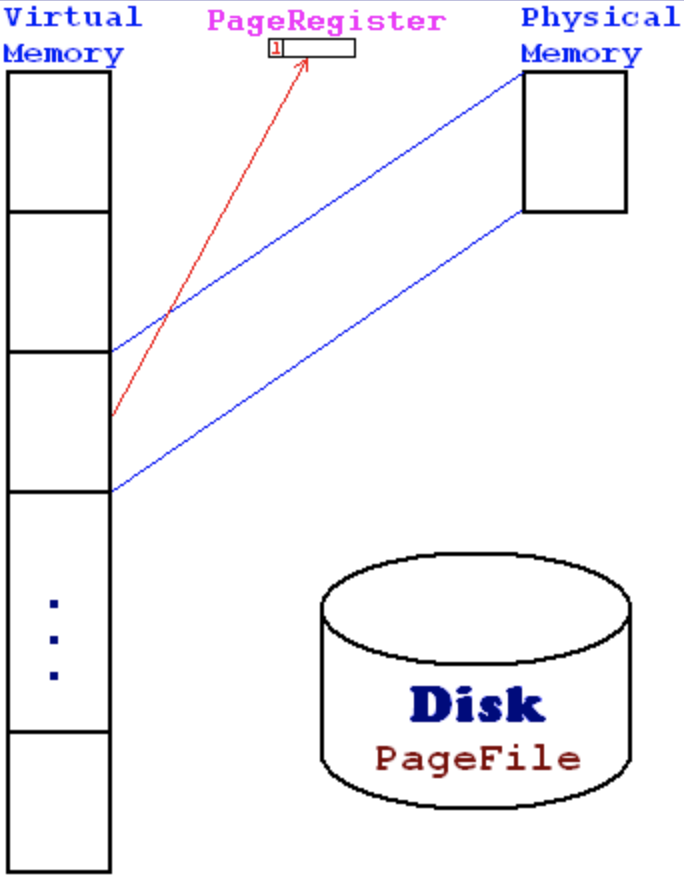
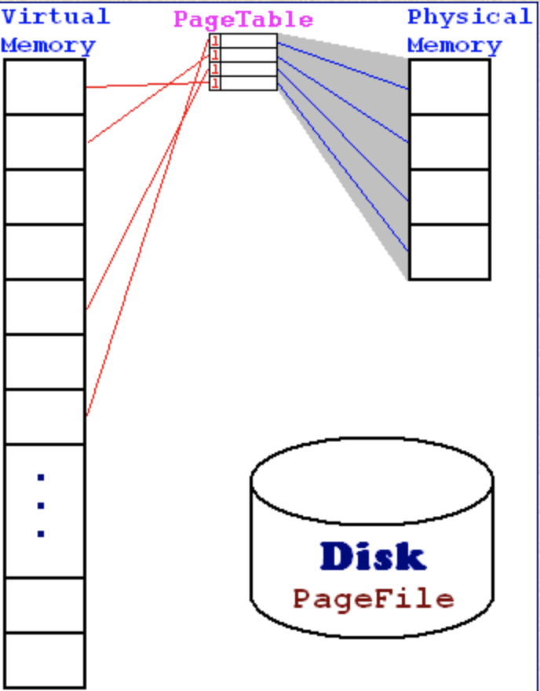
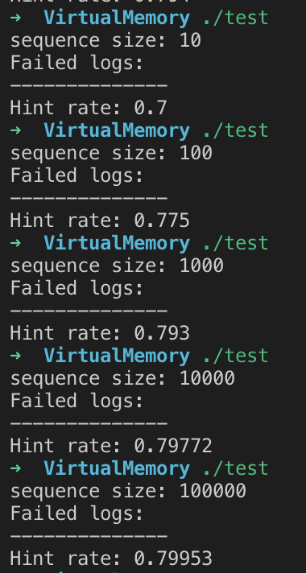
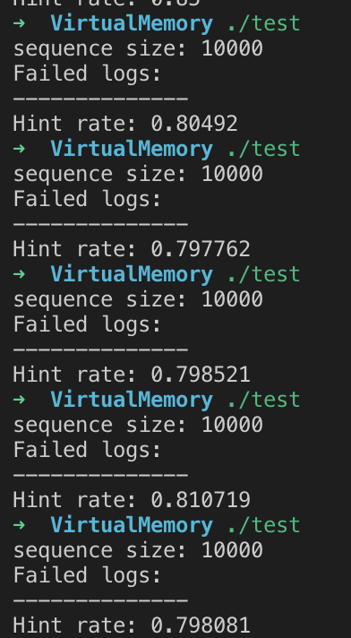

# 作业 虚拟存储

```
姓名：Maple
学号：**********
```

## 一、问题描述

设：存储器int[] Memory=new int[16K];系统以zjie寻址，虚拟存储每页4Kzjie。(zjie=short)，编写函数： 

int LW(int adr);和void SW(int adr, int dat); 

其中：adr范围：0~1Gzjie。 

做好分析，说明采用单页映射、反向页表、正向页表、多级页表哪种页表方式，每种方式的优缺点对比。

验证：设计一随机存储器访问序列，并计算其命中率。 

## 二、方法选择

### 2.1 单页映射

单页映射指的是整个物理存储器为一页，将磁盘按整个物理存储器的大小划分，用一个寄存器表示目前的页码，如下图所示



这种实现方法的优点是实现简单，但缺点也是很明显的，命中率低，因为只有一个内存页。

### 2.2 反向页表

反向页表指的是将存储器分为多个页，有一个页表，存的是存储器页对应的磁盘中的页号，也就是虚拟内存的页号，如下图所示



这种实现方法使用多页内存，有效提高了命中率，但每次检测访问地址是否在物理内存时，都需要搜索一遍页表，会浪费一些时间。

### 2.3 正向页表

正向页表也是将物理内存分页，不同于正向页表的是，正向页表在页表中存储的是每个虚拟内存中的页对应的物理内存中的页，如下图所示


这种实现方法有效解决了反向页表需要搜索一遍页表的问题，但同样，以空间换时间，虚拟内存大的话页表会占用很大的空间。

### 2.4 最终选择

本次作业最后选择的是反向页表的实现，主要有以下理由：

1. 单页映射命中率太低
2. 正向页表在本次作业中需要1MB的空间，不适合于软件模拟
3. 对于反向页表来说，每一页有4K，存储器只有16K，所以页表只有4个页，这种遍历可以视为常数时间的
4. 反向页表不需要额外的存储空间

## 四、运行结果

### 4.1 测试方法

在这次作业中，我写了一个随机访问序列类来模拟对内存的访问，访问范围为0到1Gzjie.

由于空间局部性，对内存的访问在80%概率下都是在一个内存块内（80%来自百度百科），这里我采用的是有80%概率，下一次访问是以以上一次访问位置为期望的高斯分布的位置。另外20%的概率是随机跳转一个位置。

随机访问序列生成器伪代码：

```cpp
void gen(int size)
{
  sequence S;
  int r = rand() % 10;
  int last;
  for i = 0 to size {
    if(r > 1) {
      last = gauss() + last;
      S.push(last);
    }
    else {
      last = rand();
      S.push(last)
    }
  }
}
```

测试时，首先使用随机访问序列访问内容，调用sw将地址存入内存单元，以便lw校对。然后访问x个地址后，重新使用随机访问序列访问内存，调用lw方法，比对lw的和sw的是否一致，如果不一致就输出failed，要注意的是，由于不对齐存储，前面的存储有可能会被覆盖，所以测试时要比较四个数值。

```cpp
int main()
{
  Sequence S;
  MemoryUnit MU;
  for x in S:
  	MU.sw(x, x)
  for x in S:
  	int y = S.lw(x)
    if(y == x || y == x-1&0xFFFF << 16 | x &0xFFFF ||
       y == x &0xFFFF0000 | x+1 &0xFFFF0000 >> 16 ||
       y == x-1 &0xFFFF << 16 | x+! &0xFFFF000 >> 16)
      ;
  	else
      cout << "failed" << endl;
  cout << MU.hintRate() << endl;
}
```

### 4.2 测试结果

首先测试访问次数从10递增到100000



可见对拍结果，对虚拟内存的访问没有出现failed的情况，可以得出程序的正确性。接下来，可以看到命中率随着随机访问的次数渐渐变高，这个是因为随次数变多，随机性下降，频率收敛于概率。

然后多次测试100000大小的序列



我们发现，命中率约在80%，这个数字与我们假设的空间局部性相符，可见虚拟内存的命中率更多依赖于空间局部性原理。

## 五、总结与展望

这次实验模拟了虚拟内存，通过对三种实现方式的比较，权衡之下，最后选择了使用正向页表。实验中发现，虚拟内存的命中率更大的依赖于局部性原理的概率，当然，也有可能是随机序列无法完全模拟实际应用的原因。接下来会把虚拟内存应用在MIPS模拟机中，增大模拟机的寻址范围。